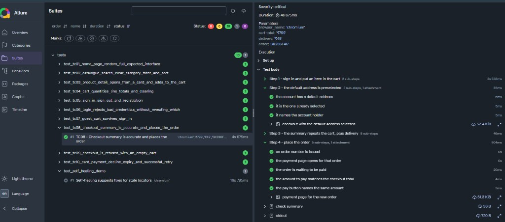
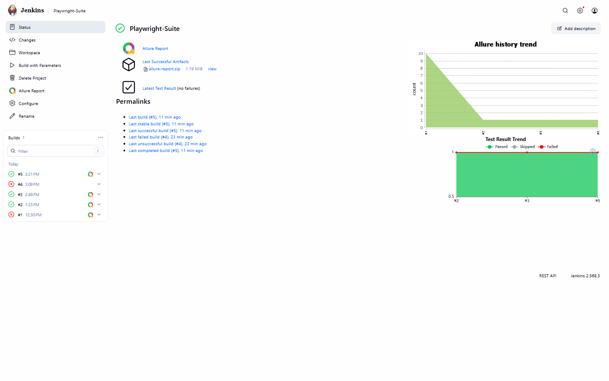

# AItomationKart — Playwright Automation Framework

Python + Playwright + pytest test suite for [AItomationKart](https://atharvajoshi.pythonanywhere.com),
a demo e-commerce site built specifically to be automated against.

Functional UI tests with soft assertions, so one run reports every failed check
rather than stopping at the first. Each run builds a cumulative Allure report
with per-step screenshots. The test plan is an Excel workbook generated from
Python, so it stays reviewable as a diff.

Two helpers use an LLM: one drafts test cases from a feature spec, the other
suggests a replacement for a locator the page has lost. Neither decides whether
a test passes.

TC01 to TC10 are automated, plus the self-healing demo; the rest are automated one
at a time.

- **Application under test:** https://atharvajoshi.pythonanywhere.com
- **Application source:** https://github.com/atharvajoshibsl/AItomationKart
- **Test plan:** `TEST_PLAN.xlsx` — 18 active cases, 9 deferred
- **Latest report:** https://atharvajoshibsl.github.io/PlaywrightAutomationFramework/ — published by CI on every green run

## Automation status

| Case | Name | Area | Suite | Status |
|------|------|------|-------|--------|
| TC01 | Home page renders the full expected interface | Interface | Smoke | Automated |
| TC02 | Catalogue search, clear, category filter and sort | Catalogue | Smoke | Automated |
| TC03 | Product detail opens from a card and adds to the cart | Product detail | Smoke | Automated |
| TC04 | Cart quantities, line totals and clearing | Cart | Smoke | Automated |
| TC05 | Sign in, sign out and registration | Auth | Sanity | Automated |
| TC06 | Login rejects bad credentials without revealing which | Auth | Regression | Automated |
| TC07 | Guest cart survives sign-in | Guest flow | Sanity | Automated |
| TC08 | Checkout summary is accurate and places the order | Checkout | Sanity | Automated |
| TC09 | Checkout is refused with an empty cart | Checkout | Regression | Automated |
| TC10 | Card payment: decline, expiry and successful retry | Payment | Sanity | Automated |
| TC11 | UPI payment approves after its window | Payment | Regression | Planned |
| TC12 | Wallet payment succeeds and is refused when short | Payment | Regression | Planned |
| TC13 | Order history and detail match what was bought | Orders | Regression | Planned |
| TC14 | Another account's order is not reachable | Orders | Regression | Planned |
| TC15 | Profile details and address book | Profile | Regression | Planned |
| TC16 | Health and reset return a known starting state | Test API | Smoke | Planned |
| TC17 | Each visitor is isolated from another's reset | Test API | Regression | Planned |
| TC18 | Self-healing suggests fixes for stale locators | Framework | Regression | Automated |

Full steps and expected results for every case live in `TEST_PLAN.xlsx`. The
`TCF_*` rows below the active table are deferred scope.

## Setup

Needs Python 3.10+, and Java 11+ with the Allure CLI for reports.

```powershell
git clone https://github.com/atharvajoshibsl/PlaywrightAutomationFramework.git
cd PlaywrightAutomationFramework

py -m venv .venv
.\.venv\Scripts\Activate.ps1
pip install -r requirements.txt
playwright install

winget install --id Microsoft.OpenJDK.21
npm install -g allure-commandline
```

Restart the terminal, then check `java -version` and `allure --version`. Without
Allure the tests still run; you just get raw results instead of HTML.

## Running the suite

```powershell
py -m pytest                                  # everything, headless
py -m pytest --headed                         # watch the browser
py -m pytest -m smoke                         # one suite
py -m pytest tests/test_tc01_home_page_renders_full_expected_interface.py
py -m pytest --base-url http://127.0.0.1:8000 # a local copy of the app
```

`pytest.ini` points at the hosted site, so a plain `py -m pytest` needs no
arguments. `--headed`, `--browser`, `--slowmo` and `--tracing` come from
`pytest-playwright`.

## Reports

Every run builds its own report, so running the tests and having a current
report are the same action.



Every case opens into its plan steps, every step into its checks, and the
screenshot each step took is attached inside it.

| Path | What it is |
|------|-----------|
| `reports/latest-report.html` | The report to open. One self-contained file with screenshots embedded. Overwritten each run |
| `reports/runs/run-NNN_*.zip` | A permanent copy of each run's raw results |
| `reports/allure-history/` | Kept across runs, so reports show trends |

Rebuild any archived run:

```powershell
py tools/view_run.py        # list archives
py tools/view_run.py 18     # rebuild run 18 and open it
```

Nothing under `reports/` is committed. Screenshots are attached to the open
Allure step rather than saved as files, so they appear inside the step that
took them.

## Continuous integration and delivery

A Jenkins job, `Playwright-Suite`, runs the same suite on every trigger and
publishes the report of any green run to
[GitHub Pages](https://atharvajoshibsl.github.io/PlaywrightAutomationFramework/).
Small, but both halves: CI checks out, installs and tests; CD ships the report.



The job pulls `main` from GitHub, then runs three batch steps:

```bat
python -m venv .venv                       :: first step, the environment
.venv\Scripts\python -m pip install -r requirements.txt
.venv\Scripts\python -m playwright install chromium

.venv\Scripts\python -m pytest %SUITE% %EXTRA% --junitxml=reports/junit.xml

git clone --branch gh-pages ...        :: third step, the deploy
copy reports\latest-report.html gh-pages\index.html
git commit -am "..." && git push
```

Three parameters decide what runs, how and where:

| Parameter | Choices | Effect |
|-----------|---------|--------|
| `SUITE` | `tests`, `-m smoke`, `-m sanity`, `-m regression`, or a single test file | What to run |
| `MODE` | `headless`, `headed` | Adds `--headed` |
| `NODE` | `built-in`, `desktop` | Which agent runs the build |

Afterwards the JUnit plugin publishes `reports/junit.xml` for pass/fail history,
and the Allure plugin builds its report from `reports/allure-results`. JUnit gives
the trend graph, Allure gives the steps and screenshots.

**The deploy step is gated by the tests.** A Freestyle job stops at the first
failing step, so the push to `gh-pages` only happens when the run is green — a
red run leaves the published report at the last good one. Its GitHub token comes
from a Jenkins credential bound to `GH_TOKEN`, never from the repo.

**Headed runs need a desktop agent.** The Jenkins service has no desktop, so a
browser it launches is invisible even with `--headed`. That is what `NODE=desktop`
is for: an agent running `agent.jar` in the logged-in Windows session, started by
`start-jenkins-agent.bat` and left open. Close that window mid-build and the
build fails with `Backing channel 'desktop' is disconnected`. The agent's secret
is read from `agent-secret.txt`, which is gitignored.

## Layout

```
PlaywrightAutomation/
├─ conftest.py        Shared fixtures and the end-of-run report build
├─ pytest.ini         Target URL, Allure output, markers
├─ TEST_PLAN.xlsx     The reviewable plan: 18 active cases, 9 deferred
├─ docs/              Screenshots used in this README
├─ start-jenkins-agent.bat  Brings the Jenkins desktop agent online
├─ framework/
│  ├─ config.py       What the app should contain — the suite's oracle
│  ├─ money.py        Prices to integers and back
│  ├─ soft_assert.py  Assertions that record a failure instead of stopping
│  └─ reporting.py    Report generation, history, run archiving
├─ pages/            One class per page: its locators and its actions
│  ├─ base.py         Header, flash messages and screenshots, shared
│  ├─ home.py         The listing, its product cards and the footer
│  ├─ product.py      Detail page and variants
│  ├─ cart.py         Lines, summary, update and clear
│  ├─ auth.py         Login and registration
│  ├─ checkout.py     Addresses, summary, placing the order
│  ├─ payment.py      Card form and what it reports
│  └─ orders.py       History and a single order
├─ tests/
│  ├─ test_tc01_home_page_renders_full_expected_interface.py
│  ├─ test_tc02_catalogue_search_clear_category_filter_and_sort.py
│  ├─ test_tc03_product_detail_opens_from_a_card_and_adds_to_the_cart.py
│  ├─ test_tc04_cart_quantities_line_totals_and_clearing.py
│  ├─ test_tc05_sign_in_sign_out_and_registration.py
│  ├─ test_tc06_login_rejects_bad_credentials_without_revealing_which.py
│  ├─ test_tc07_guest_cart_survives_sign_in.py
│  ├─ test_tc08_checkout_summary_is_accurate_and_places_the_order.py
│  ├─ test_tc09_checkout_is_refused_with_an_empty_cart.py
│  ├─ test_tc10_card_payment_decline_expiry_and_successful_retry.py
│  └─ test_self_healing_demo.py  Stale locators on purpose, to show healing
├─ ai/
│  ├─ design_tests.py  Drafts test cases from a feature
│  ├─ feature.txt      The feature to draft from — replace with your ticket
│  └─ self_heal.py     Suggests a locator to replace one the page has lost
└─ tools/
   ├─ build_test_plan.py  Regenerates TEST_PLAN.xlsx
   └─ view_run.py         Rebuilds an archived run into HTML
```

## AI capability

Both tools work by retrieval, not recall: the model is given real context and
asked to reason over it, and its answer is then checked in Python.

| Tool | Context it is given | Output |
|------|--------------------|--------|
| `ai/design_tests.py` | The feature spec, plus TC01 and TC02 as style examples | Draft cases in the plan's columns |
| `ai/self_heal.py` | The live page's elements, read with one `page.evaluate` | A locator verified to match one element |

Paste your Gemini key into `ai/api_key.txt` once. The model is
`gemini-3.5-flash-lite`, a constant at the top of each file.

### Drafting test cases

```powershell
py ai/design_tests.py
```

Put a feature into `ai/feature.txt`. It asks how many cases you want, writes
them to `ai/ai_test_cases.csv`, and lists any acceptance criterion no case
covers. Read the CSV, say what to improve, and the rows are rewritten. Copy the
keepers into `TEST_PLAN.xlsx` yourself — the AI never writes to the plan.

### Self-healing locators

```powershell
pytest tests/test_self_healing_demo.py -s
```

A test asks for elements through `heal.find(testid, purpose)`. At the end,
`heal.report()` reads the page once and asks the model only about testids that
are missing, then prints and attaches this:

```
[heal] 4 of 6 locators are not on the page:

1) actual:    page.get_by_test_id("search-box")
   suggested: page.get_by_role("searchbox", name="Search products")  (1.00)
   at:        test_self_healing_demo.py:49

4) actual:    page.get_by_test_id("checkout-now")
   suggested: nothing matches, may be a defect
   at:        test_self_healing_demo.py:65
```

Three rules keep it honest:

- **It suggests, never repairs.** A failing test still fails.
- **The suggestion is verified.** `best_locator` tries `get_by_role`, testid,
  placeholder and text against the page, keeping the first with `count() == 1`.
- **It refuses rather than guesses.** No matching element means no suggestion,
  because a healer that invents one turns a real bug green.

Silent when nothing is broken. For one locator without running a test:

```powershell
py ai/self_heal.py "add-to-cart-button" "the button that adds to the cart"
```

### Seeing it in the Allure report

Open `reports/latest-report.html` and find **TC18**. It is `xfail`, so Allure
files it under skipped. Its last step, `Healing suggestions for 4 of 6
locators`, holds the `self-healing suggestions` attachment.

## Design decisions

**Soft assertions for checks, hard failures for actions.** `SoftAssert.check`
collects outcomes and fails once at the end, so one run tells you every broken
check. Actions stay hard: if "Add to cart" never clicks, later assertions about
the cart are noise.

**Page objects hold the locators, tests hold the checks.** Each class in
`pages/` names one page's elements and the actions on it, so a changed test id
is a one-line fix in one file. What counts as correct stays in the test, where
the case can be read against the plan.

**Expected data lives in `framework/config.py`.** When the shop adds a
category, one line changes there and every test that cares fails until it does.

**Locators prefer `data-testid`.** The app carries test ids throughout, so
tests do not depend on CSS structure or wording. Where an id is missing, the
product card image for example, a class selector is used instead.

**Every test starts from a known state.** The `shop` fixture calls the app's
reset endpoint. Each visitor gets their own database keyed to a session cookie,
so runs cannot interfere with each other or with the live site.

**One case per page or flow, not one per click.** Checks on the same page are
steps inside one case. Rendering is covered once, by TC01.

## Adding a test case

1. Read the case in `TEST_PLAN.xlsx`.
2. Copy `tests/test_tc02_*.py` as the pattern: docstring, allure decorators,
   suite markers, one step per plan step.
3. Take the `shop` fixture and build the page objects the case needs.
4. Page objects for actions and locators, `soft.check` for the observations
   after them. Add a locator to the page class rather than the test.
5. Put new expected values in `framework/config.py`.
6. Call `soft.assert_all()` last.
7. Name the file `test_tcNN_<case name in snake case>.py`.

## Editing the test plan

Edit `tools/build_test_plan.py` and re-run it, so the plan stays reviewable in
git rather than only inside a binary. Close Excel first — it holds a write lock.

```powershell
py tools/build_test_plan.py
```

## Roadmap

- Automate TC11 onward, one case at a time
- GitHub Actions as a second runner, alongside Jenkins
- Parallel execution, and an API-level layer alongside the UI cases
- Cache accepted heals to disk, and retrieval over the plan so drafts do not
  duplicate coverage

## Author

Atharva Joshi — built alongside
[AItomationKart](https://github.com/atharvajoshibsl/AItomationKart), the demo
shop it tests.
